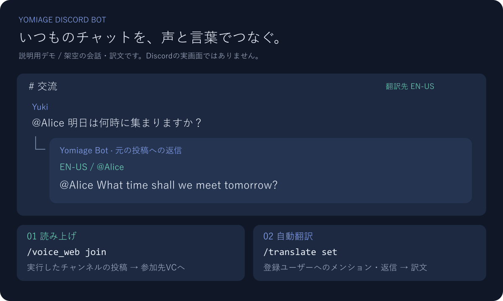
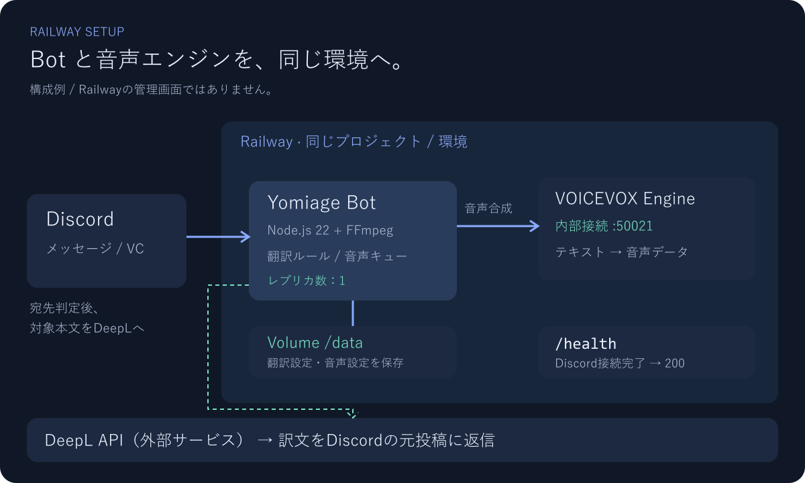

# Yomiage Discord Bot

指定したテキストチャンネルの投稿をVOICEVOXで音声化し、Botが参加したボイスチャンネルで読み上げます。指定ユーザー宛てのメンション・返信をDeepLで自動翻訳する機能もあります。翻訳はボイスチャンネルに接続していなくても動作します。



> 画像は機能を説明するためのデモです。実際のDiscord画面やAPIの実行結果ではなく、ユーザー名・会話・訳文は架空の例です。

| できること | 操作 |
| --- | --- |
| テキスト投稿を参加先のVCで読み上げ | `/voice_web join` |
| 声・速度・音程を変更 | `/voice_web settings` |
| 特定ユーザーへのメンション・返信を翻訳 | `/translate set` |
| 翻訳対象の確認・解除 | `/translate list` / `/translate remove` |
| 再起動後も翻訳設定を保存 | Railway Volume + `DATA_DIR` |

**初めて使う場合:** [Discordの設定](#discordの設定) → [Railwayへのデプロイ](#railwayへのデプロイ) → [動作確認](#動作確認)の順に進めてください。

[ローカル起動](#ローカルで動かす) · [環境変数](#環境変数) · [読み上げ](#読み上げ) · [自動翻訳](#自動翻訳) · [トラブルシューティング](#トラブルシューティング)

## ローカルで動かす

Node.js **22.12以上**、読み上げには **FFmpeg** が必要です。Dockerイメージには同梱しています。

```sh
npm ci
```

[.env.example](.env.example) を `.env` にコピーして、[環境変数](#環境変数)を設定します。RailwayではVariablesへ設定してください。

```powershell
# Windows PowerShell
Copy-Item .env.example .env
```

```sh
# macOS / Linux
cp .env.example .env
```

```sh
npm run build
npm run deploy-commands
npm start
```

開発起動は `npm run dev`、外部APIやBotへ接続しない自動テストは `npm test`。
コマンド追加後は再度 `npm run deploy-commands` を実行してください。登録失敗時は終了コード1を返します。

## 環境変数

| 変数 | 用途 |
| --- | --- |
| `DISCORD_TOKEN` | 必須。Botトークン。互換名 `TOKEN` |
| `CLIENT_ID` | コマンド登録時に必要なApplication ID。互換名 `DISCORD_CLIENT_ID` |
| `GUILD_ID` | 任意。指定するとそのサーバーにコマンド登録。未指定はグローバル登録 |
| `DEEPL_API_KEY` | 自動翻訳に必要。DeepL API Free / Proのキー。末尾`:fx`でFreeを判別 |
| `VOICEVOX_ENGINE_URL` | VOICEVOX Engineの接続先。例 `http://voicevox.railway.internal:50021`。指定時はこちらを優先 |
| `VOICEVOX_API_KEY` | 既存の外部Web API方式を利用する場合のキー |
| `DATA_DIR` | 設定の保存先。ローカル既定`config`、Docker既定`/data` |
| `PORT` | ヘルスチェック用ポート。Railwayから注入。ローカル既定3000 |

`VOICEVOX_ENGINE_URL` と `VOICEVOX_API_KEY` は利用方式に応じて選びます。両方を設定するとEngine方式が優先されます。翻訳だけを利用する場合、音声用の設定は不要です。

## Discordの設定

[Discord Developer Portal](https://discord.com/developers/applications)でアプリを開き、Bot設定で **MESSAGE CONTENT INTENT** を有効化します。`GuildVoiceStates` はコードで指定済みの通常Intentで、Portalの特権Intent設定は不要です。

Botを `bot` / `applications.commands` スコープでサーバーに招待し、利用チャンネルで次の権限を付与してください。

- テキスト: チャンネルを見る、メッセージを送信、メッセージ履歴を読む
- ボイス: チャンネルを見る、接続、発言

Application IDは **General Information**、Botトークンは **Bot** で確認します。サーバーIDが必要な場合はDiscordの **ユーザー設定 → 詳細設定 → 開発者モード** をONにし、対象サーバーを右クリックしてIDをコピーします。

## 読み上げ

1. 自分が読み上げ先のボイスチャンネルに参加します。
2. 監視したいテキストチャンネルで `/voice_web join` を実行します。
3. そのチャンネルへの投稿を投稿順に読み上げます。
4. `/voice_web leave` で停止します。

`/voice_web settings` で声・速度・音程などを変更できます。`status` で接続設定、`test` でテスト再生ができます。サーバーごとに同時に1つのボイス接続と1つの監視チャンネルを使用します。Botの投稿は読み上げません。1件500文字、待機100件までで、それ以上の文字は省略、満杯時の新規投稿はスキップします。

VOICEVOX Engine方式は `/audio_query` と `/synthesis` を利用します。Engineは別サービスとして起動し、BotからアクセスできるURLを設定してください。既存のWeb API方式は `deprecatedapis.tts.quest` を利用する互換機能として残していますが、その外部サービスの稼働は未検証です。

再起動で音声接続は切れるため `/voice_web join` を再実行してください。音声設定は保存されます。通常のボイスチャンネルを対象にしており、ステージでの発言許可の自動取得は行いません。

## 自動翻訳

設定には **サーバー管理** 権限が必要です。国籍は推測せず、ユーザーが読む言語を明示して登録します。

```text
/translate set channel:#交流 user:@Alice language:英語（米国）
/translate list channel:#交流
/translate remove channel:#交流 user:@Alice
```

登録後、`#交流` で `@Alice 明日は何時に集まりますか？` と投稿するか、Aliceの投稿に返信すると、英訳を元メッセージへの返信として同じチャンネルに投稿します。返信時にユーザー通知をOFFにしていても対象になります。

- 対象は直接のユーザーメンションと返信。ロールメンションや`@everyone`、対象本人の自分宛て投稿、Bot/Webhook、本文のない添付だけの投稿は対象外です。
- 元言語は自動判定。1チャンネル20ユーザーまで登録可能。同じ言語の宛先が複数あってもAPI呼び出しは1回です。
- 本人の通常発言の日本語化、過去の投稿・編集済みメッセージの再翻訳、スレッド内の投稿は対象外です。
- 訳文によるメンション通知は発生させません。長い訳文は分割して送信します。訳文は自動読み上げしません。
- APIタイムアウトは15秒。失敗は元投稿への返信で通知し、読み上げと後続の翻訳を継続します。全体で処理中・待機100投稿までとし、満杯時の新規投稿はスキップしてログに残します。
- 設定は`DATA_DIR/translation.json`へ保存します。解除後は未処理の投稿にも解除を反映しますが、処理中の翻訳は完了する場合があります。

**翻訳対象の本文はDeepLへ送信され、訳文はそのチャンネルの閲覧者に公開されます。** API利用量はDeepLの契約に従います。

## Railwayへのデプロイ



*説明用の構成図です。Railwayの管理画面のスクリーンショットではありません。*

### 1. GitHubからBotサービスを作成

今回のコードをGitHubへコミット・プッシュしたうえで、[Railway](https://railway.com/)の **New Project → Deploy from GitHub repo** からリポジトリを選択します。既存サービスがある場合は、そのサービスの接続先ブランチに変更を反映します。[公式ガイド](https://docs.railway.com/quick-start)

[railway.toml](railway.toml) と [Dockerfile.railway](Dockerfile.railway) がビルド・起動を設定済みです。

| 項目 | このリポジトリの設定 |
| --- | --- |
| Root Directory | リポジトリのルート（`/`） |
| Builder | Dockerfile |
| Dockerfile | `Dockerfile.railway` |
| Runtime | Node.js 22 / FFmpeg同梱 |
| Start Command | Dockerfileの `node build/main.js` を使用 |
| Healthcheck Path | `/health`（待機300秒） |
| Replicas | **1**（設定ファイルの競合・重複返信を防止） |

以前のBuild Command / Start Commandの手動上書きがある場合は解除してください。旧 `railway.yml` / `railway.minimal.yml` / `nixpacks.toml` は、この手順では使いません。

### 2. VOICEVOXの接続先を用意

**Engine方式:** 同じRailwayプロジェクト・環境にDocker Imageのサービスを追加し、次の公式CPU用イメージを指定します。

```text
voicevox/voicevox_engine:cpu-latest
```

Botとは別のサービスです。起動コマンドはイメージの既定値を使い、Bot用の `/health` 設定はコピーしないでください。[VOICEVOX公式のDocker手順](https://github.com/VOICEVOX/voicevox_engine#docker-イメージ)

サービスのNetworkingで内部ドメインを確認します。たとえば `voicevox.railway.internal` なら、Bot側の接続先は次のとおりです。

```dotenv
VOICEVOX_ENGINE_URL=http://voicevox.railway.internal:50021
```

ドメインは実際の表示に置き換えます。`localhost` はBot自身を指すため、別サービスの接続先には使いません。同じプロジェクト・環境のサービス間通信には[プライベートネットワーク](https://docs.railway.com/networking/private-networking)を使います。

**既存Web API方式:** 外部APIのキーを使用する場合は、`VOICEVOX_ENGINE_URL` を設定せず、`VOICEVOX_API_KEY` を設定します。互換用の外部サービスは稼働未検証です。

### 3. BotのVariablesを設定

**Botサービス**の **Variables → Raw Editor** に以下を貼り付け、プレースホルダーを実際の値に置き換えます。

```dotenv
DISCORD_TOKEN=YOUR_DISCORD_BOT_TOKEN
CLIENT_ID=YOUR_APPLICATION_ID
GUILD_ID=YOUR_DISCORD_SERVER_ID
DEEPL_API_KEY=YOUR_DEEPL_API_KEY
NODE_ENV=production
DATA_DIR=/data
VOICEVOX_ENGINE_URL=http://voicevox.railway.internal:50021
```

`GUILD_ID` を指定すると、そのサーバーにコマンドを登録します。未指定ではグローバル登録になります。`PORT` は基本的に手動設定不要です。`.env` や秘密のキーをGitHubへアップロードしないでください。

Variablesの変更は保存後、**Deploy** で反映します。[Variables公式説明](https://docs.railway.com/variables)

### 4. Volumeを追加

BotサービスにVolumeを追加し、**Mount Path** を `/data` にします。[Volumes公式説明](https://docs.railway.com/volumes)

```text
Botサービス
  DATA_DIR=/data
  Volume Mount Path=/data
```

保存されるファイルは `translation.json`（翻訳設定）と `voice_web_config.json`（音声設定）です。Volumeがない場合、再デプロイで設定を失う可能性があります。

### 5. デプロイとコマンド登録

デプロイ後、Botサービスのログに `ログイン成功` が表示されることを確認します。`/health` はDiscord接続準備完了時に200、未接続時に503を返します。音声API・DeepLへの接続確認は含まれません。

次に、次のどちらかで **一度だけ** コマンドを登録します。Bot起動時の自動登録はありません。

**ローカルから登録:** Node.jsのあるPCで `.env` にBotと同じ `DISCORD_TOKEN`、`CLIENT_ID`、必要なら `GUILD_ID` を設定して実行します。

```sh
npm ci
npm run build
npm run deploy-commands
```

**Railway上で登録:** [Railway CLI](https://docs.railway.com/cli)を用意し、ダッシュボードでBotサービスの **Copy SSH Command** から接続コマンドを取得します。接続したBotコンテナ内で実行します。

```sh
cd /app
npm run deploy-commands
```

接続には `railway ssh` を使います。詳しくは[SSH公式手順](https://docs.railway.com/cli/ssh)を参照してください。登録成功ログを確認してからDiscordへ戻ります。

## 動作確認

| 確認すること | 操作 | 期待する結果 |
| --- | --- | --- |
| Botの応答 | `/ping` | 応答が返る |
| 読み上げ開始 | 自分がVCに入り、監視したいテキストチャンネルで `/voice_web join` | Botが同じVCに参加する |
| 音声再生 | 監視チャンネルに「こんにちは」と投稿 | VCでユーザー名と本文が読まれる |
| 翻訳設定 | `/translate set channel:#交流 user:@Alice language:英語（米国）` | 対象ユーザーと言語の登録が確認できる |
| メンション翻訳 | `#交流` で別ユーザーから `@Alice 明日は何時に集まりますか？` | 元投稿に英訳が返信される |
| 返信翻訳 | 別ユーザーからAliceの投稿に返信 | メンション通知OFFでも翻訳される |
| 設定確認 | `/translate list channel:#交流` | AliceとEN-USが表示される |
| 停止・解除 | `/voice_web leave`、`/translate remove channel:#交流 user:@Alice` | 退出・対象登録の解除ができる |

上記は手動確認の手順で、実機で検証済みという意味ではありません。ローカルの自動テストはDiscord・外部APIをモックして検証します。Railwayでの実再生は、実際のBot・API設定で確認してください。

## 再起動・更新時の動作

- 翻訳設定・音声設定は、Volumeに保存されていれば再起動後も読み込みます。
- **ボイス接続は自動復元しません。** 再起動後は `/voice_web join` を再実行してください。
- 待機中の読み上げ・翻訳はメモリ上にあるため、再起動時に失われます。
- 新しいスラッシュコマンドを追加・変更したら、`npm run deploy-commands` を再実行します。
- 翻訳対象の本文はDeepLへ、読み上げ対象は設定した音声APIへ送信します。サービスの利用量は各契約に従います。

## トラブルシューティング

| 症状 | 確認すること |
| --- | --- |
| 起動直後に終了する | BotサービスのVariablesに `DISCORD_TOKEN` が設定されているか |
| `disallowed intents` が出る | Developer PortalでMessage Content IntentをONにしたか |
| `/translate` が表示されない | コマンド登録を実行したか。`CLIENT_ID`・`GUILD_ID`が正しいか。実行者にサーバー管理権限があるか |
| ヘルスチェックが失敗する | BotのログでDiscordへのログイン失敗を確認。ポートはRailwayの`PORT`を使用しているか |
| VCには入るが読まない | `/voice_web join` を実行したチャンネルに投稿しているか。Botの発言権限、VOICEVOX接続先、Message Content Intentを確認 |
| ボイス接続がタイムアウトする | Botの接続・発言権限と、実行環境からDiscord VoiceへのUDP通信を確認 |
| `ENOTFOUND` / 音声APIへ接続できない | Engineが起動済みか。同じRailway環境か。内部ドメインとポート50021が正しいか |
| 翻訳されない | `DEEPL_API_KEY`、`/translate list`、直接メンション・返信の宛先、Botの閲覧・送信・履歴閲覧権限を確認 |
| 翻訳失敗の返信が出る | ログのDeepL HTTPステータスを確認。キー・利用上限・通信状態を確認 |
| 再デプロイ後に設定が消える | Volume Mount Pathと`DATA_DIR`がともに`/data`か |

## その他の既存コマンド

`/ping`、`/lottery`、`/shift`、`/cleanup`、`/list_channels` は継続利用できます。

## ドキュメント画像

画像の編集元は [docs/images/demo.svg](docs/images/demo.svg) と [docs/images/railway-architecture.svg](docs/images/railway-architecture.svg) です。READMEには日本語フォントの見え方を揃えたPNGを掲載しています。どちらも説明用に作成した図で、実画面のスクリーンショットではありません。

## 参照

- [DeepL Translate API](https://developers.deepl.com/api-reference/translate/request-translation)
- [discord.js Voice](https://discord.js.org/docs/packages/voice/0.19.2)
- [Railway Config as Code](https://docs.railway.com/config-as-code/reference)
